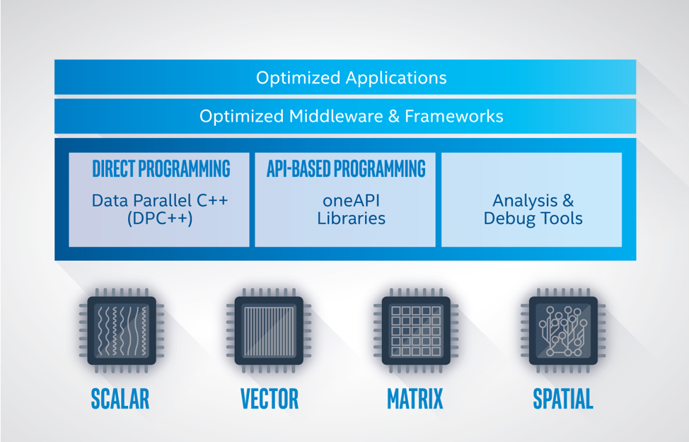
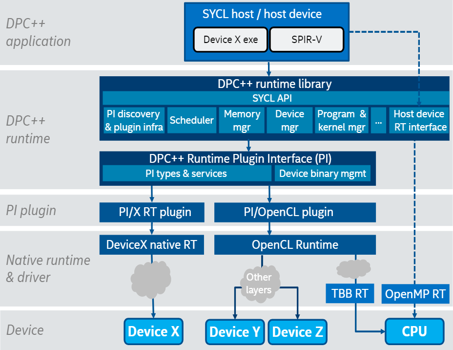
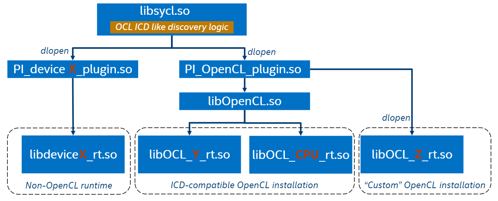
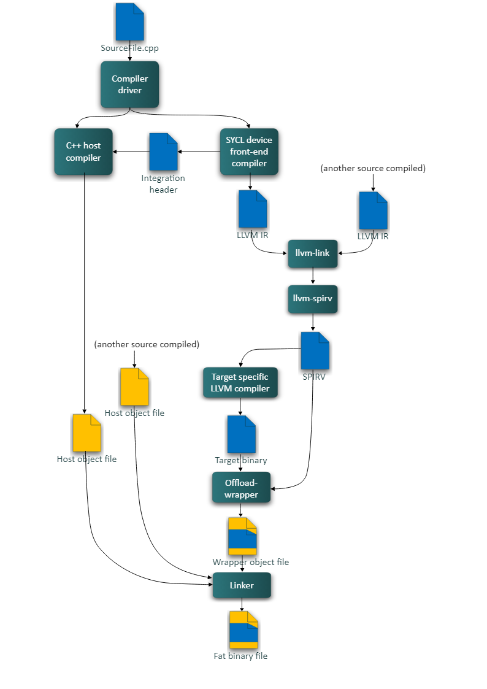
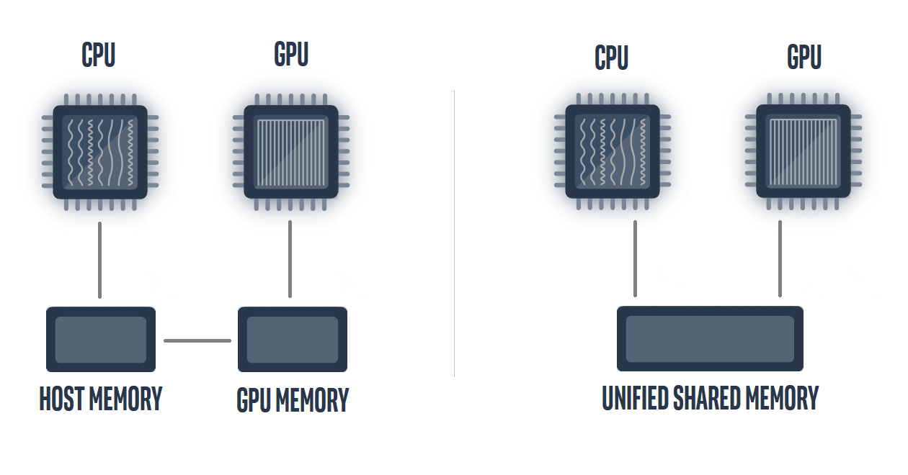

-----

| Title     | OPT PARA DPCPP Arch                               |
| --------- | ------------------------------------------------- |
| Created @ | `2023-03-07T03:55:03Z`                            |
| Updated @ | `2024-04-07T02:24:00Z`                            |
| Labels    | \`\`                                              |
| Edit @    | [here](https://github.com/junxnone/opt/issues/15) |

-----

# 架构及相关概念

## 架构

### Runtime

### Compiler Pipeline

## 相关概念

### Device

  - CPU/GPU/FPGA/Accelerator
  - kernel 运行的设备
  - 可以通过相关 APIs 获取 Name/Vendor/Version/...

### Queue

  - 用于异构执行任务的机制
  - 每个 queue 映射到一个 Device
  - 多个 queue 可以映射到同一个 Device
  - 通过 `xxx_selector` 选取 Device
      - 可以通过自定义 selector 创建选择 device 的策略

### Kernel

  - 用于执行的数据并行代码
  - 在 kernel 被调度时构建
  - Kernel 中 使用 C++ 有限制
  - `range` 用来描述迭代空间
  - `id` 用来索引执行实例
  - `item` 可以获取 id & range
  - 并行 Kernel
      - `Basic Data Parallel Kernels` - 通过 `range` 控制并行
      - `ND-Range Data Parallel Kernels` - 通过 `nd range` 控制更好的在硬件并行
      - `Hierarchical Parallel Kernels`
  - C++ Lambda Function

### USM Unified Shared Memory

  - 需要硬件支持 `统一虚拟地址空间`
  - 三种分配方式
      - Host - `malloc_host()` Host 分配, Host & Device 都可以访问
      - Device - `malloc_device()` Device 分配，只能 Device 访问
      - Shared - `malloc_shared()` 编译器管理
  - 方便 porting C++ code
  - 当有数据依赖时需要显式的指定
      - `q.wait()`
      - ` queue q{property::queue::in_order()};  `
      - `depends_on(e)`

### Buffer

  - 封装的数据结构
  - 同步 Buffer 到 Host Memory
      - 通过 host\_accessor
      - 通过 Buffer Destruction
          - 当使用 已有的变量创建 Buffer, Buffer 注销时，数据会同步到 变量

### [Accessor](https://registry.khronos.org/SYCL/specs/sycl-2020/html/sycl-2020.html#subsec:accessors)

  - 用于 Device 访问 Buffers
  - `host_accessor` 用于在 host 访问 buffer 同步数据到 host
      - 阻塞调用，会等所有入队 kernel执行完毕
  - `local_accessor`
  - Accessor 会创建 `数据依赖`，可以限制两个 Kernel 同时访问 Buffer
  -
