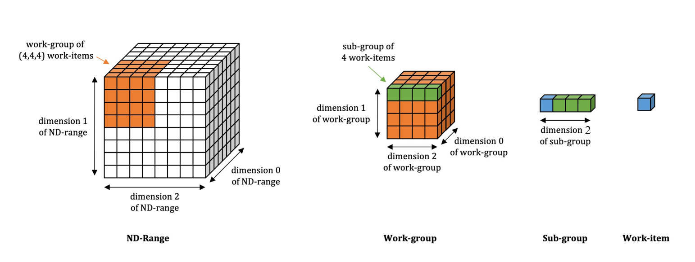
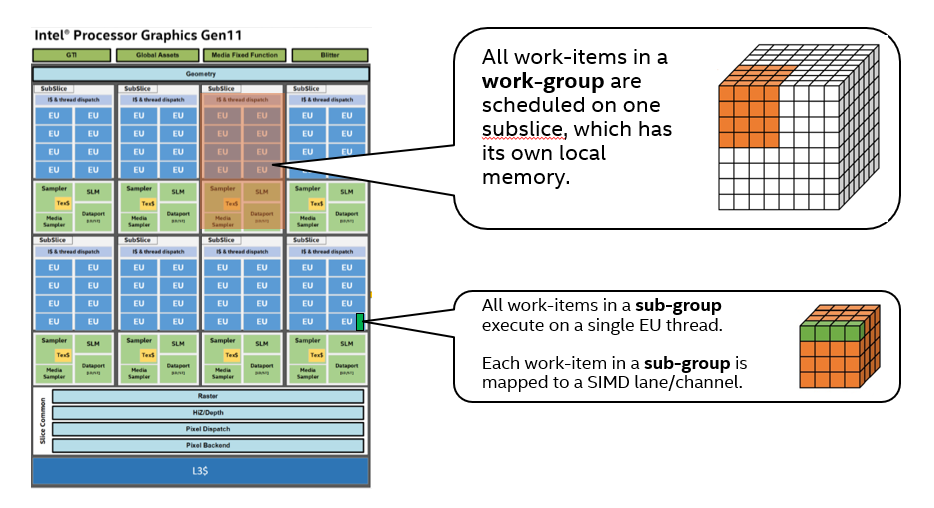
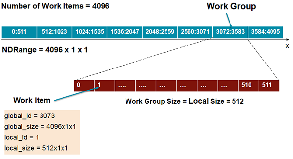
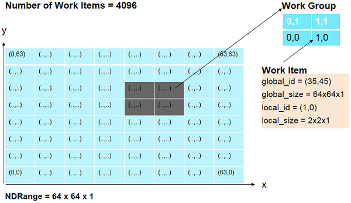
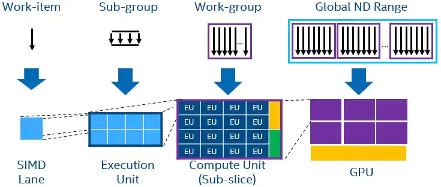
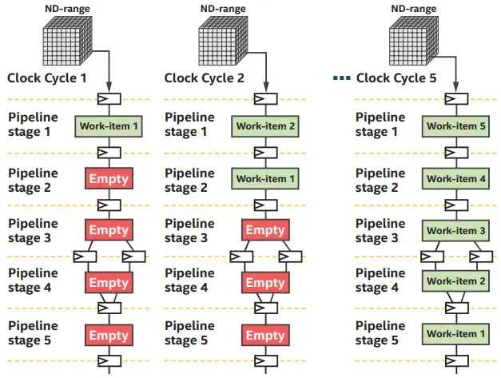

-----

| Title     | PARA NDRange                                      |
| --------- | ------------------------------------------------- |
| Created @ | `2021-11-19T01:12:36Z`                            |
| Updated @ | `2024-04-07T02:26:16Z`                            |
| Labels    | \`\`                                              |
| Edit @    | [here](https://github.com/junxnone/opt/issues/18) |

-----

# NDRange

  - NDRange 相对 Basic Parallel kernels 可以更好的利用Hardware，拥有更好的性能
      - Local Memory
      - Mapping Executions

### Work Group

  - 同一个 wrok-group 中的 work-items 调度进同一个处理单元
  - work-group memory - work-items 可以访问同 group 的 memory，不必重新载入
  - work-group barriers/fences 同步 work-items
  - work-group collectives 通信
  - sub-group functions and algorithms

### SubGroup

  - 同一个 SubGroup 中的 work-items 同时并行处理
  - 同一个 SubGroup 中的 work-items 可以使用 `shuffle operations` 通信
  - 可以通过 sub-group barriers 同步
  - 可以使用 sub-group memory fences 保证内存一致性

<!-- end list -->

    Device : 11th Gen Intel(R) Core(TM) i9-11900KB @ 3.30GHz
    Supported Sub-Group Sizes : 4 8 16 32 64 
    Max Sub-Group Size        : 64
    
    
    Device : Intel(R) UHD Graphics [0x9a60]
    Supported Sub-Group Sizes : 8 16 32 
    Max Sub-Group Size        : 32

### WrokGroup & SubGroup 处理位置

## 123 Dim

| Dims      | Figure                                                       |
| --------- | ------------------------------------------------------------ |
| One Dim   |  |
| Two Dim   |  |
| Three Dim |  |

## NDRange Mapping to Hardware

| Devices | Mapping                                                      |
| ------- | ------------------------------------------------------------ |
| CPU     |  |
| iGPU    |  |
| FPGA    |  |

## Reference

  - [One-Dimensional
    NDRange](https://www.xilinx.com/html_docs/xilinx2017_4/sdaccel_doc/ece1504034297316.html)
  - [DPC++ Thread Hierarchy and
    Mapping](https://www.intel.com/content/www/us/en/develop/documentation/oneapi-gpu-optimization-guide/top/thread-mapping.html)
  - [Mapping of oneAPI and DPC++ to CPUs, GPUs, and
    FPGAs](https://www.intel.com/content/www/us/en/developer/articles/technical/comparing-cpus-gpus-and-fpgas-for-oneapi.html?wapkw=NDRANGE#gs.ivap1r)
  - [ND-range data-parallel
    kernels](https://enccs.github.io/sycl-workshop/expressing-parallelism-nd-range/)
