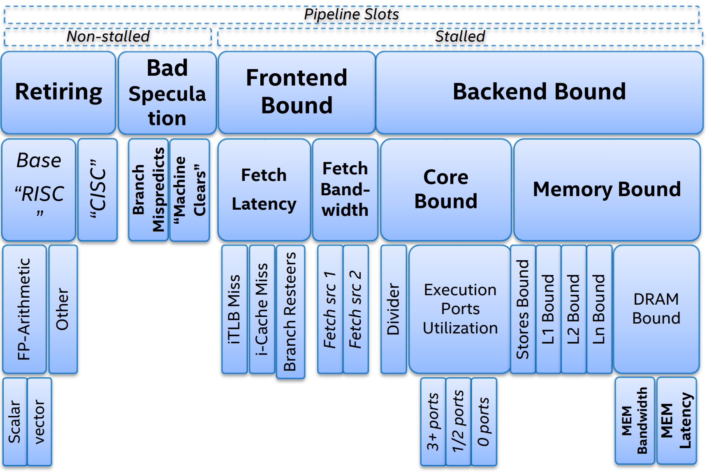
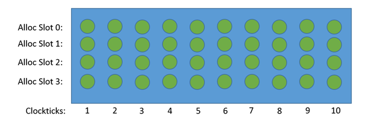
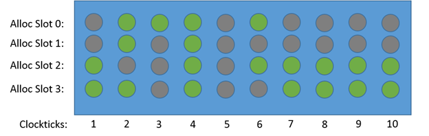

-----

| Title     | OPT TMA                                           |
| --------- | ------------------------------------------------- |
| Created @ | `2022-04-27T01:48:41Z`                            |
| Updated @ | `2024-05-20T01:14:04Z`                            |
| Labels    | \`\`                                              |
| Edit @    | [here](https://github.com/junxnone/opt/issues/47) |

-----

# TMA

  - TMA - `Top-Down Microarchitecture Analysis`

## 层次结构/Hierarchy

  - 利用 `TMA` 结果进行分析的时候，我们只需要关注第一层级中比重最高的分支，然后逐级向下去追溯最关键的性能瓶颈便可.
      - 例如 如果 `Backend Bound` 占用较多，则向下看 `Core Bound` 和 `Memory Bound`
        哪个占用的更多，如果是 `Memory Bound`, 则是因为 `CPU` 不能够及时的从 `Memory`
        获取所需的数据导致的，继续查看是 Cache/DRAM/... 哪个的问题

### 第一层: CPU 状态分类

  - **Retiring**: 正常执行的 μOps 比例
  - **Bad Speculation**: Cancelled ( `Mispredicted branches`/`Incorrect
    data speculation`)
  - **Front-End Bound**: front-end 导致的 pipeline slots 不能被充分使用
  - **Back-End Bound**: back-end 导致的 pipeline slots 不能被充分使用

## 相关名词

  - **μOps**: `micro-ops/micro-operations` 微指令
  - **DSB**: `Decoded-μop Stream Buffer`

### Pipeline Slots

  - **Pipeline Slots**: 处理一个 μOps 需要的硬件资源
      - 对于每个 `CPU Core`, 在每个时钟周期, 有多个可用的 `Pipeline Slots`, 数量称为
        `Pipeline Width`

| 40 Pipeline Slots = 4-wide CPU X 10 Clock cycles             | Retiring(50%) = SlotsRetired/TotalSlots                      |
| ------------------------------------------------------------ | ------------------------------------------------------------ |
|  |  |

## Reference

  - [TMA\_自顶向下的CPU架构性能瓶颈分析方法](https://zhuanlan.zhihu.com/p/60569271)
  - [《A Top-Down Method for Performance Analysis and Counters
    Architecture》阅读笔记](https://andrewei1316.github.io/2020/12/20/top-down-performance-analysis/)
  - [自顶向下的微架构分析方法 -
    Intel](https://www.intel.com/content/www/us/en/develop/documentation/vtune-cookbook-zh-cn/top/methodologies/top-down-microarchitecture-analysis-method.html)
    2014 **TMA** [A Top-Down method for performance analysis and
    counters
    architecture.pdf](https://github.com/junxnone/linuxwiki/files/8559242/A.Top-Down.method.for.performance.analysis.and.counters.architecture.pdf)
  - [Pipeline
    Slots](https://www.intel.com/content/www/us/en/develop/documentation/vtune-help/top/reference/cpu-metrics-reference/pipeline-slots.html)
  - [Instructions Retired
    Event](https://www.intel.com/content/www/us/en/develop/documentation/vtune-help/top/analyze-performance/custom-analysis/custom-analysis-options/hardware-event-list/instructions-retired-event.html)
