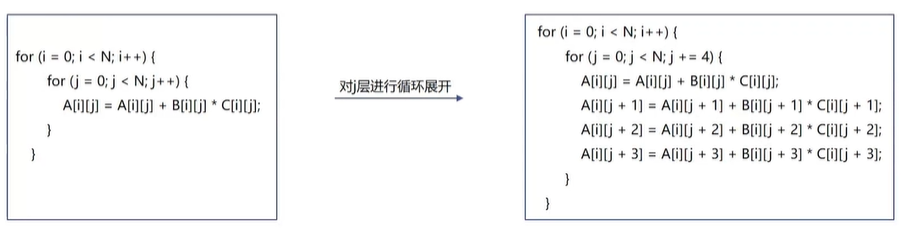

-----

| Title     | Loop                                              |
| --------- | ------------------------------------------------- |
| Created @ | `2021-12-14T07:42:33Z`                            |
| Updated @ | `2024-07-13T05:15:52Z`                            |
| Labels    | \`\`                                              |
| Edit @    | [here](https://github.com/junxnone/opt/issues/49) |

-----

# Loop Optimization

  - Loop Pipelining
  - Loop Unrolling - 循环展开
  - 编译器可以自动优化一部分循环

## Loop Pipelining

| No Loop |  |
| ------------------------------------------------------------------- | ------------------------------------------------------------ |

## Loop Unrolling

  - 牺牲程序大小来加快程序执行速度的方法
  - **优化的逻辑**
      - 减少循环分支指令执行的次数
      - 更多的**指令级并行**,
      - 增加**寄存器重用**，提高**访存效率**
  - 展开方式
      - 编译器自动循环展开(LLVM - `-funroll-loops`)
      - pragma 定义展开(`#pragma clang loop unroll(enable)`)
      - 手动展开
  - 循环完全展开: 按迭代次数对循环展开
  - 过度循环展开: 增加寄存器压力, 引起缓存区溢出
  - 循环展开不能整除的尾循环处理

### 数据合法性

  - 对数据依赖进行分析
  - 数组的 `先读后写` / `先写后读`

### 编译器循环展开

  - 依赖复杂情况下无法展开
  - 一些 llvm 循环展开编译选项如下：

### pragma 实现循环展开

  - `#pragma clang loop unroll(enable)`
  - `#pragma clang loop unroll(full)` : 完全循环展开(需要知道迭代次数)
  - `#pragma clang loop unroll_count(8)` : 指定循环展开次数

<!-- end list -->

    accum = 0;
    #pragma unroll N
    for (size_t i=0; i<4; i++) {
      accum += data[i];
    }
    sum_out = accum;

| unroll/nounroll | Execution                                                    |
| --------------- | ------------------------------------------------------------ |
| nounroll        |  |
| Unroll 2        |  |
| Fully Unroll    |  |

| Basic Loop     |  |
| -------------- | ------------------------------------------------------------ |
| Unrolled Loop  |  |
| Pipelined Loop |  |

## Reference

  - [HLS Loop
    Optimizations](https://learning.intel.com/developer/learn/course/external/view/elearning/242/hls-loop-optimizations-part-3-of-7)
  - [循环优化 -
    先进编译实验室](https://space.bilibili.com/1540261574/channel/collectiondetail?sid=693322)
