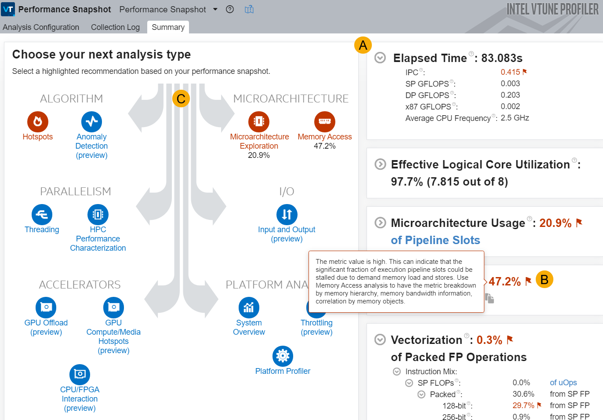

-----

| Title     | Tools Vtune PerformanceSnapshot                   |
| --------- | ------------------------------------------------- |
| Created @ | `2024-04-20T16:55:17Z`                            |
| Updated @ | `2024-04-20T16:55:17Z`                            |
| Labels    | \`\`                                              |
| Edit @    | [here](https://github.com/junxnone/opt/issues/51) |

-----

# Vtune Performance Snapshot

  - 用于评估概况，整体分析影响性能的问题，会给出下一步分析的建议。

>   - **A**: 测试的一些 Metrics (运行时间/利用率/微架构/存储器/向量化/GPU)
>   - **B**: 红色的部分代表存在性能瓶颈或者可以优化
>   - **C**: 红色的代表可以获取更详细的性能信息
