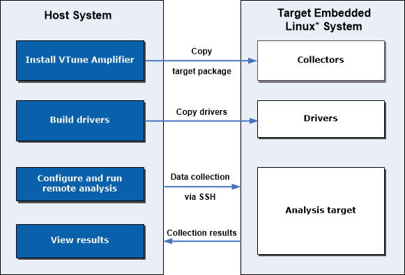

-----

| Title     | Tools Vtune Linux Remote                          |
| --------- | ------------------------------------------------- |
| Created @ | `2024-04-20T18:37:16Z`                            |
| Updated @ | `2024-04-20T18:37:16Z`                            |
| Labels    | \`\`                                              |
| Edit @    | [here](https://github.com/junxnone/opt/issues/55) |

-----

# Vtune on Remote Linux

  - 用于目标系统资源较少或者定制 Linux OS
  - 提供了三种模式，用于不同的场景:
      - `Remote CLI and GUI Usage Mode`
      - `Native Usage Mode`
      - `Native Sampling Collector (SEP) Usage Mode`
  - `Host System` 安装 Vtune
  - 设置 `Remote System`(安装不同大小的分析包)

